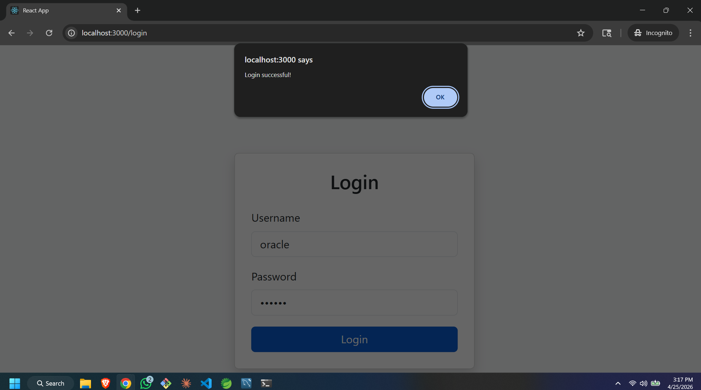
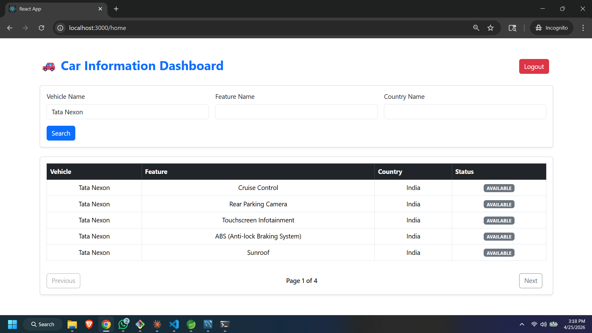
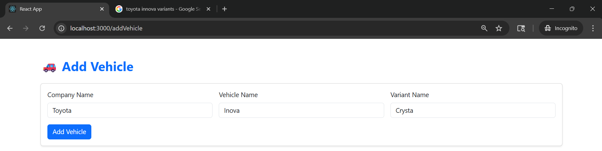
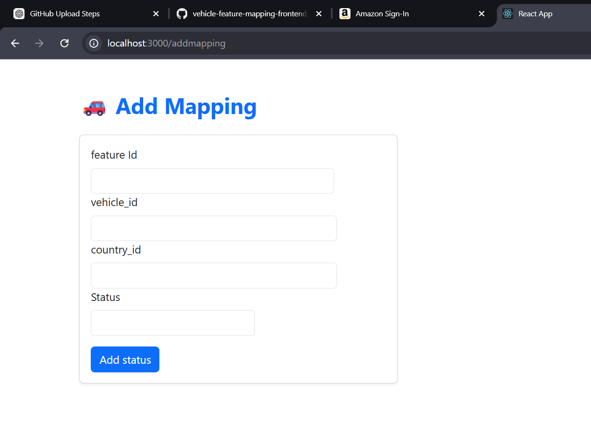
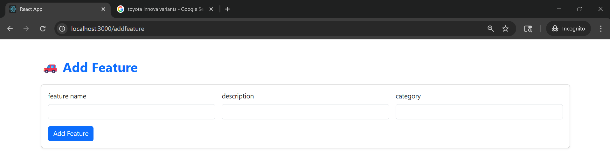

# 🚗 Vehicle Feature Mapping System — Frontend

A React.js web application that serves as the frontend for the Vehicle Feature Mapping System. It allows authenticated users to manage vehicles, features, countries, and their mappings — with a searchable, paginated dashboard to view which features apply to which vehicle in which country.

> 🔗 Backend Repository: [vehicle_feature_mapping_system](https://github.com/mahendra90999/vehicle_feature_mapping_system)

---

## 📌 Table of Contents

- [About the Project](#about-the-project)
- [Features](#features)
- [Tech Stack](#tech-stack)
- [Pages & Routes](#pages--routes)
- [Screenshots](#screenshots)
- [Getting Started](#getting-started)
- [API Configuration](#api-configuration)
- [How Authentication Works](#how-authentication-works)
- [Project Structure](#project-structure)
- [Upcoming Features](#upcoming-features)
- [Contributing](#contributing)
- [License](#license)

---

## 📖 About the Project

The frontend connects to a Spring Boot REST API backend and provides a clean Bootstrap-styled UI for:

- Logging in with JWT-based authentication
- Adding vehicles (with company name, vehicle name, and variant)
- Adding features (with name, description, and category)
- Adding countries
- Mapping a feature to a vehicle in a specific country with an applicability status
- Searching and filtering all mappings from the dashboard with pagination

All routes except `/login` are protected — unauthenticated users are redirected to the login page automatically.

---

## ✨ Features

- 🔐 **JWT Authentication** — Login with username & password; tokens stored in `localStorage`
- 🔄 **Auto Token Refresh** — Access token is silently refreshed on 401 responses using a refresh token
- 🚘 **Add Vehicles** — Register vehicle records with company, name, and variant
- ⚙️ **Add Features** — Define features with a name, description, and category
- 🌍 **Add Countries** — Register countries to the system
- 🔗 **Add Mappings** — Link a feature + vehicle + country with an `Applicable` / `Not Applicable` status
- 📊 **Dashboard** — Search and filter all mappings by vehicle, feature, or country with paginated results
- 🚪 **Logout** — Clears token and redirects to login

---

## 🛠 Tech Stack

| Layer              | Technology                  |
|--------------------|-----------------------------|
| Framework          | React.js 19                 |
| Routing            | React Router DOM v7         |
| HTTP Client        | Axios                       |
| Styling            | Bootstrap 5                 |
| Authentication     | JWT (Access + Refresh Token)|
| Build Tool         | Create React App            |
| Language           | JavaScript (ES6+)           |

---

## 📄 Pages & Routes

| Route         | Page          | Protected | Description                                      |
|---------------|---------------|-----------|--------------------------------------------------|
| `/login`      | Login         | ❌ No     | Username & password login form                   |
| `/home`       | Home          | ✅ Yes    | Dashboard — search & view all mappings           |
| `/addVehicle` | VehicleAdd    | ✅ Yes    | Add a new vehicle (company, name, variant)       |
| `/addfeature` | FeatureAdd    | ✅ Yes    | Add a new feature (name, description, category)  |
| `/addcountry` | CountryAdd    | ✅ Yes    | Add a new country                                |
| `/addMapping` | MappingAdd    | ✅ Yes    | Map a feature to a vehicle+country with a status |
| `*`           | —             | —         | Redirects to `/home`                             |

---
## 📸 Screenshots

| Login Page | Dashboard |
|------------|-----------|
|  |  |

| Add Vehicle | Add Mapping | Add Feature |
|-------------|-------------|-------------|
|  |  |  |
---

## 🚀 Getting Started

### Prerequisites

- [Node.js](https://nodejs.org/) v16 or higher
- [npm](https://www.npmjs.com/)
- The [backend server](https://github.com/mahendra90999/vehicle_feature_mapping_system) running on `http://localhost:8080`

### Installation

1. **Clone the repository**

   ```bash
   git clone https://github.com/mahendra90999/vehicle-feature-mapping-frontend.git
   cd vehicle-feature-mapping-frontend
   ```

2. **Install dependencies**

   ```bash
   npm install
   ```

3. **Start the development server**

   ```bash
   npm start
   ```

   The app runs at **http://localhost:3000**

---

## 🔧 API Configuration

All API calls are handled through a centralized Axios instance in `src/api.js`.

**Default backend URL:** `http://localhost:8080`

To change it, open `src/api.js` and update the `baseURL`:

```js
const API = axios.create({
  baseURL: "http://localhost:8080", // change this if your backend runs elsewhere
});
```

### API Endpoints Used

| Method | Endpoint               | Description                        |
|--------|------------------------|------------------------------------|
| POST   | `/api/login`           | Login and receive JWT tokens       |
| POST   | `/api/refresh-token`   | Refresh expired access token       |
| POST   | `/mappings`            | Fetch paginated & filtered mappings|
| POST   | `/mappings/add`        | Add a new feature-vehicle mapping  |
| POST   | `/vehicles/add`        | Add a new vehicle                  |
| POST   | `/features/add`        | Add a new feature                  |
| POST   | `/countries/add`       | Add a new country                  |

---

## 🔐 How Authentication Works

1. On login, the backend returns an `accessToken` and `refreshToken`
2. Both are stored in `localStorage`
3. Every request automatically attaches the `accessToken` via an Axios request interceptor:
   ```
   Authorization: Bearer <accessToken>
   ```
4. If a request returns a `401 Unauthorized`, the response interceptor automatically:
   - Calls `/api/refresh-token` with the stored `refreshToken`
   - Updates the `accessToken` in `localStorage`
   - Retries the original request
5. If the refresh also fails, the user is logged out and redirected to `/login`

---

## 📁 Project Structure

```
vehicle-feature-mapping-frontend/
├── public/
│   └── index.html
├── src/
│   ├── pages/
│   │   ├── Login.js          # Login form with JWT auth
│   │   ├── Home.js           # Dashboard with search, table & pagination
│   │   ├── VehicleAdd.js     # Add vehicle form
│   │   ├── FeatureAdd.js     # Add feature form
│   │   ├── CountryAdd.js     # Add country form
│   │   └── MappingAdd.js     # Add feature-vehicle-country mapping
│   ├── api.js                # Axios instance with JWT interceptors
│   ├── App.js                # Router with protected routes
│   ├── App.css
│   ├── home.css
│   └── index.js
├── package.json
└── README.md
```

---
## 🚧 Upcoming Features

The following features are currently in development and will be added in future releases:

- 📝 **User Signup** — Self-registration for new users
- ✏️ **Edit / Update** — Update existing vehicles, features, countries, and mappings
- 🗑️ **Delete** — Remove vehicles, features, countries, and mappings
---

## 🤝 Contributing

Contributions are welcome!

1. Fork the repository
2. Create your feature branch: `git checkout -b feature/your-feature`
3. Commit your changes: `git commit -m "Add: your feature"`
4. Push to the branch: `git push origin feature/your-feature`
5. Open a Pull Request

---

## 📄 License

This project is open-source and available under the [MIT License](LICENSE).

---

## 👤 Author

**Mahendra**
- GitHub: [@mahendra90999](https://github.com/mahendra90999)
- Frontend: [vehicle-feature-mapping-frontend](https://github.com/mahendra90999/vehicle-feature-mapping-frontend)
- Backend: [vehicle_feature_mapping_system](https://github.com/mahendra90999/vehicle_feature_mapping_system)
